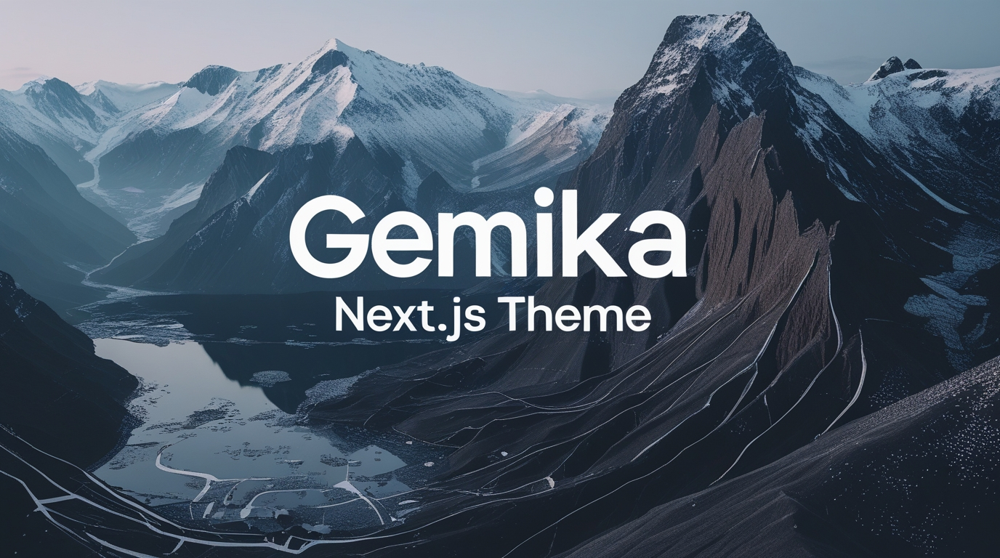

# 🚀 Gemika Next.js Theme

<div align="center">

[](#)
[](#)
[](#)
[](#)
[](#)

[](https://app.netlify.com/sites/gemika/deploys)
[](https://vercel.com/leonism/gemika-nextjs-theme)
[](https://opensource.org/licenses/MIT)

</div>


## 📖 Overview

Gemika Next.js Theme is a modern, scalable web application template designed for developers aiming to build high-performance applications. Leveraging Next.js, MDX, Tailwind CSS and Turbopack, this project provides an optimized, forward-thinking development environment complete with robust configurations and up-to-date dependencies. Whether you're starting a new project or looking to enhance an existing one, this theme offers a practical and efficient foundation built with industry best practices in mind.

## 📋 Table of Contents

- [🚀 Gemika Next.js Theme](#-gemika-nextjs-theme)
  - [📖 Overview](#-overview)
  - [📋 Table of Contents](#-table-of-contents)
  - [✨ Features](#-features)
  - [🛠️ Installation](#-installation)
  - [🏃 Development](#-development)
  - [🏗️ Building for Production](#-building-for-production)
  - [🌍 Deployment Options](#-deployment-options)
    - [Vercel Deployment](#vercel-deployment)
    - [Cloudflare Pages Deployment](#cloudflare-pages-deployment)
    - [Netlify Deployment](#netlify-deployment)
  - [📊 Project Structure](#-project-structure)
  - [🧩 Components](#-components)
  - [📝 Content Management](#-content-management)
  - [🎨 Styling](#-styling)
  - [📱 Responsive Design](#-responsive-design)
  - [🔍 SEO Optimization](#-seo-optimization)
  - [📈 Performance](#-performance)
  - [📜 Changelog](#-changelog)
  - [🤝 Contributing](#-contributing)
  - [📄 License](#-license)

## ✨ Features

- ⚡ Turbocharged development with Turbopack
- 🌙 Dark/light mode toggle with smooth transitions
- 📱 Fully responsive design for all device sizes
- 🔍 Advanced search functionality with relevance scoring
- 📝 MDX-powered content system for rich content
- 🎨 Gradient-heavy UI with smooth animations
- 📊 SEO optimized with JSON-LD structured data
- 📱 Mobile-first approach with touch-friendly interactions
- 🧩 Modular component architecture
- 🔄 API routes for dynamic content
- 🌐 Internationalization support
- 🔒 Security best practices implemented

## 🛠️ Installation

Get started with these simple steps:

```bash
# Clone the repository
git clone https://github.com/leonism/gemika-nextjs-theme.git

# Change directory
cd gemika-nextjs-theme

# Install dependencies
npm install
```

## 🏃 Running the Development Server

To start the development server with Turbopack, run:

```bash
npm run dev
```

Open [http://localhost:3000](http://localhost:3000) in your browser to see the application. The page will automatically update as you make changes to the code. You'll see build errors and lint warnings in the console.

## 🏗️ Building for Production

To create an optimized production build, run:

```bash
npm run build
```

After building the project, you can start the production server with:

```bash
npm run start
```

The server will run on [http://localhost:3000](http://localhost:3000).

## 🌍 Deployment Options

### Vercel Deployment

The easiest way to deploy your Next.js app is to use the Vercel Platform .

```bash
# Install Vercel CLI
npm install -g vercel

# Deploy
vercel
```

### Cloudflare Pages Deployment

Deploy to Cloudflare Pages for global edge network distribution:

```bash
# Install dependencies
npm install --save-dev @cloudflare/next-on-pages

# Build for Cloudflare Pages
npm run pages:build

# Deploy to Cloudflare Pages
npm run pages:deploy

# Or do both in one go
npm run deploy
```

### Netlify Deployment

Deploy to Netlify for continuous deployment:

```bash
# Install Netlify CLI
npm install -g netlify-cli

# Deploy
netlify deploy
```

## 📊 Project Structure

```text
gemika-nextjs-theme/
├── app/               # App router directory
│   ├── about/         # About page
│   ├── api/           # API routes
│   ├── contact/       # Contact form
│   ├── posts/         # Blog posts
│   ├── projects/      # Project showcase
│   └── resources/     # Resource library
├── components/        # Reusable components
├── content/           # MDX content
├── lib/               # Utility functions
├── public/            # Static assets
└── styles/            # Global styles
```

## 🧩 Components

Gemika includes a rich set of pre-built components:

- 🎯 UI components (buttons, cards, forms)
- 📊 Layout components (containers, grids)
- 🧭 Navigation components (navbar, sidebar)
- 📱 Responsive components (adapting to different screen sizes)
- 🎭 Animation components (transitions, effects)

## 📝 Content Management

Content is managed through MDX files in the content/ directory:

- 📄 Blog posts
- 🖼️ Projects
- 📚 Resources
- 📋 Pages

## 🎨 Styling

Styling is powered by:

- 🎨 Tailwind CSS for utility-first styling
- 🌈 CSS variables for theming
- 🌙 Dark mode support
- 📱 Responsive design utilities

## 📱 Responsive Design

The theme is built with a mobile-first approach:

- 📱 Optimized for mobile devices
- 💻 Responsive on tablets
- 🖥️ Fully functional on desktop
- 📺 Support for large screens

## 🔍 SEO Optimization

Built-in SEO features include:

- 📊 JSON-LD structured data
- 🏷️ Meta tags
- 🔗 Canonical URLs
- 🗺️ Sitemap generation
- 🤖 robots.txt configuration

## 📈 Performance

Performance optimizations include:

- ⚡ Code splitting
- 🖼️ Image optimization
- 🔄 Incremental Static Regeneration
- 📦 Bundle size optimization
- 🚀 Server-side rendering where appropriate

## 📜 Changelog

### v0.1.0 (Current)

- 🚀 Initial release with core functionality
- 📝 Complete portfolio sections
- 📚 Blog with pagination
- 📊 Resource library
- 🌙 Dark/light mode toggle
- 🔍 Search functionality

## 🤝 Contributing

We welcome contributions! Please follow these steps:

1. Fork the repository
2. Create your feature branch ( git checkout -b feature/amazing-feature )
3. Commit your changes ( git commit -m 'Add some amazing feature' )
4. Push to the branch ( git push origin feature/amazing-feature )
5. Open a Pull Request

## 📄 License

MIT © [Gemika Haziq Nugroho]

💖 Made with Next.js, TailwindCSS, MDX, TypeScript, and lots of coffee!
